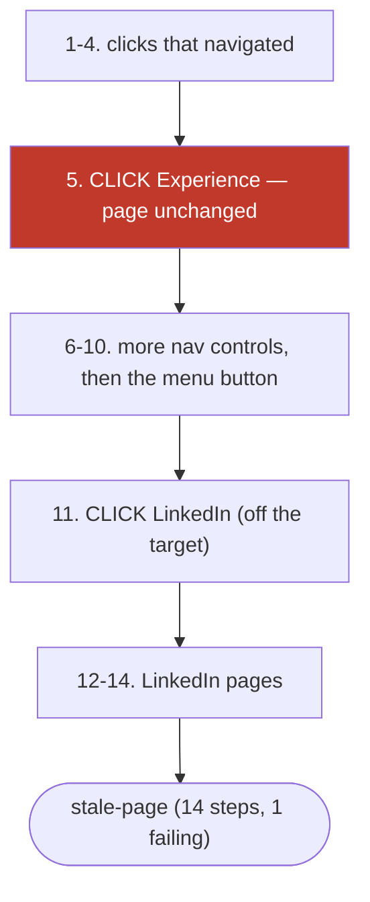

# Four arms, two live sites, one harness bug at a time

The question that started this was simple: does the packaged `jev-qa` command
actually explore a website, or does it just look like it does? To answer it we
ran the same command four times over two live targets, once for each of the two
decision arms the owner asked to compare, and read back only what the run
folders recorded. Two harness bugs turned up on the way, both shipped today:
the first made every arm stop at step zero, the second made arms stop after one
click on pages that keep redrawing.

| Run | Arm | Site | Executed steps | Pages reached | What the walk did |
| --- | --- | --- | --- | --- | --- |
| 1 | Jev (OpenRouter Decisions, `typesafe/jev-1.13`) | design-bakery.com | 14 | 6 | Clicked Research, Blogs, Projects; flagged a dead nav control; then wandered onto LinkedIn |
| 2 | OpenJev (APUS-OpenJev-4B, local Ollama) | design-bakery.com | 25 | 1 | Chose the same hero link 25 times; never left the landing page |
| 3 | Jev | study.design-bakery.com | 0 | 0 | Read a login-gated guest page and answered BLOCKED |
| 4 | OpenJev | study.design-bakery.com | 2 | 1 | Clicked Sign in, reached the form, then died on a missing text source |

All four ran at `main` `adca368`, viewport 1280×720, Playwright evidence stage
on, vision off, budget 25 steps, identical goals. Together: 41 executed steps
and 221 recorded rows.

## What each run recorded

Run 1 is the only one that behaved like a browsing user. It navigated three
sections of the portfolio, raised a dead-control defect on the Experience nav
link at step 5, and then clicked a footer link to LinkedIn at step 11. Most of
its 37 broken-link rows were measured on LinkedIn's own pages after that, so
they describe LinkedIn's rate limiting, not the target site. The dead control is
genuinely the target's: the click executed and the page did not change.

Run 2 proves the model, not the harness, is the weak link now. The page
fingerprint never changed at all: 25 clicks on the same hero control, 25
identical fingerprints, and a dead-control defect raised as early as step 1.
The harness then kept asking the same question 24 more times and kept getting
the same answer at 0.46–0.66 confidence — the model signalling it is unsure —
until the step budget ran out on one page. A walk that never varies and never
recovers from its own dead-control finding is a model-quality result, not a
site defect.

Runs 3 and 4 hit the same wall from different sides. Study OS gives a guest a
login screen with working controls. Jev looked at it, answered BLOCKED at 0.33
to 0.36 confidence, and clicked nothing. OpenJev engaged: it clicked Sign in,
reached the credentials form, then chose TYPE_TEXT on the Email field with
nothing to type, because a loopback arm carries no text model. The browser
rejected the call and the walk ended with an error that names the target URL but
belongs to us.

## Defects worth keeping, and the noise

Of 221 rows, three groups deserve different trust.

The dead controls are corroborated twice, independently, on the same site:
Jev's Experience click and OpenJev's hero click, each recorded with the step
that executed it and the page that refused to change.

The Content-Security-Policy console errors on study.design-bakery.com are a real
site issue: an inline theme script and the Cloudflare insights beacon both
violate the site's own `script-src 'self'` rule. Both arms that reached the page
recorded it, and header inspection confirms it independently of the browser
console. They stay candidates because a console error's blast radius is unproven.

The layout rows are measurement, not judgment. 176 of them, mostly decorative
blur blobs positioned deliberately off-canvas, plus sub-pixel box-model
differences where a 59-pixel icon reports a 58-pixel scroll width against a
50-pixel client box. The recorded arithmetic holds against the viewport in every
sampled row; the rule needs tightening before any of them is called a defect.

The remaining rows are ours, not the sites': a CDP parameter error from a form
field with no text source, and LinkedIn's bot blocks (HTTP 999 and 400) reached
through a footer link. The harness labelled the first a browser error on the
target, which is the wrong attribution, and it correctly kept the second as
candidates.

<details>
<summary>Run 1 chart, the walk that left its target</summary>



</details>

## What this does and does not prove

It proves the harness records truthfully. Every row above traces to a file,
every judgment is in `decisions.jsonl` before its action ran, and the three
failures of imagination in runs 2 to 4 are visible there without anyone editing
a report.

It does not prove the arms can explore a real app. Only one of four walks left
its starting page, and one of four stayed on the target site. Two of the causes
are open gaps in this repository's own code, recorded in `summary.json`:
loopback arms have no text source for form fields, and a walk that clicks a
third-party link inherits that third party's pages as if they were the target's.

The acceptance bar for a site defect — one reproducible frontend defect per
target — is met on design-bakery.com with two corroborated dead controls. On
Study OS it is met in a weaker sense: both arms reached the page and recorded
the CSP violation, and no arm got past the guest login to exercise the product.
That is the honest state, held open on issue #9 rather than called a pass.

## Reproducing

```bash
uv run jev-qa --url https://www.design-bakery.com --runner jev --provider openrouter \
  --yes --no-browser --max-steps 25 \
  --goal "check every visible navigation and menu link works" \
  --goal "open sections and report any page that errors or overflows the window"
```

The same command with `--provider openjev` is run 2, and either URL with either
provider gives the other three. The OpenJev arm needs Ollama running with
`hf.co/apus-ailab/APUS-OpenJev-v1-4B-GGUF:Q4_K_M` pulled; the Jev arm needs
`OPENROUTER_MODEL=typesafe/jev-1.13` exported, because the shipped `.env` names
a chat model the decisions endpoint rejects with HTTP 400. Each run writes its
own folder under `qa-runs*/`, git-ignored and self-contained: `defects.csv`,
`events.json`, `decisions.jsonl`, `workflow.mmd`, `run.json`, `report.html`.
This folder holds copies of the four `workflow.mmd` files and the four
`defects.csv` files, which is everything needed to check the numbers here.
